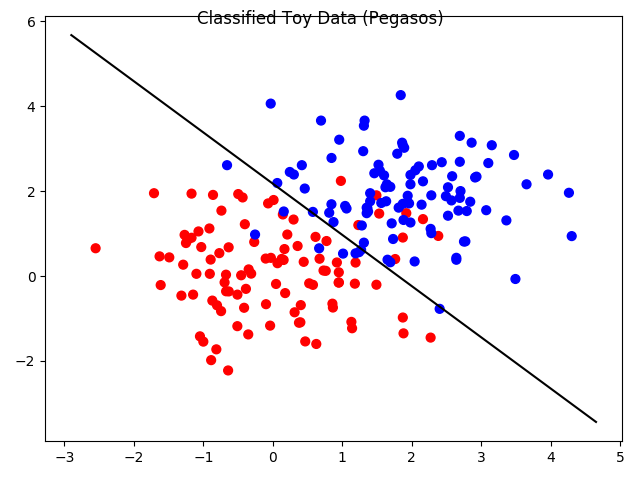
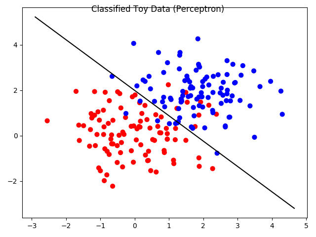
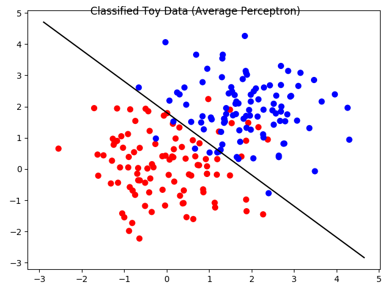
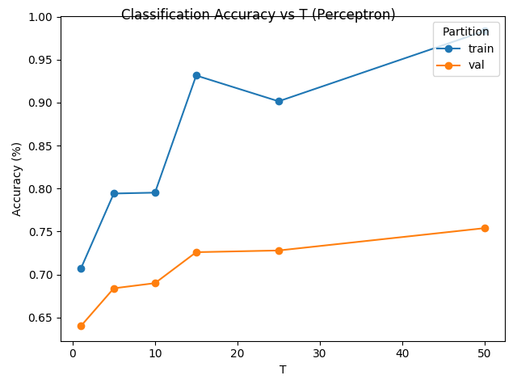
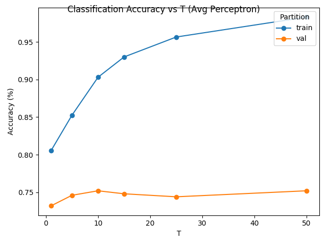
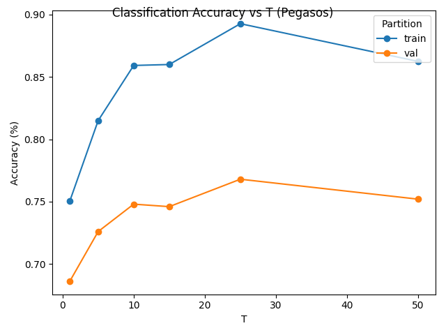
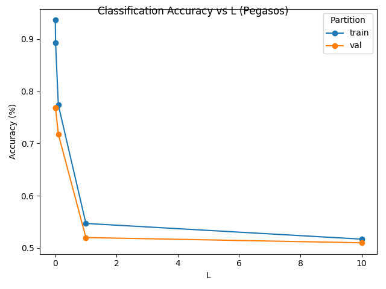

# Sentiment-analysis
Study project for the Machine Learning course

## Goal 
The goal of this project is to design a classifier to use for sentiment analysis of product reviews. Our training set
consists of reviews written by Amazon customers for various food products. The reviews, originally given on a 5 point scale,
have been adjusted to a +1 or -1 scale, representing a positive or negative review, respectively.

## ML algorithms
In order to automatically analyze reviews, I have completed the following tasks:
1. Implement and compare three types of linear classifiers: the __perceptron algorithm__,
the __average perceptron algorithm__, and the __Pegasos__ algorithm.
2. Use your classifiers on the food review dataset, using some simple text features.
3. Experiment with additional features and explore their impact on classifier performance.

## The Data
The data consists of several reviews, each of which has been labeled with __−1__ or __+1__, corresponding to a _negative_
or _positive_ review, respectively. The original data has been split into four files:
- ``reviews_train.tsv`` (4000 examples)
- ``reviews_validation.tsv`` (500 examples)
- ``reviews_test.tsv`` (500 examples)

We will convert review texts into feature vectors using a __bag of words__ approach.

## Baseline Accuracy

__Validation accuracy__ for:

| Algorithm      | Accuracy |
|----------------|:--------:|
| Perceptron     |  0.7160  |
| Avg Perceptron |  0.7980  |
| Pegasos        |  0.7900  |

## Parameter Tuning
Tune hyperparameters with a grid search over all the possible combinations of values.

Best hyperparameters' values:
- ``T`` = 25
- ``L`` = 0.01 (for _Pegasos algorithm_)

## Accuracy on the test set
Accuracy after choosing best hyperparameters:

| Algorithm      | Train | Test |
|----------------|:--------:|:--------:|
| Perceptron     |  0.9985  |  0.8140  |
| Avg Perceptron |  0.9988  |  0.8140  |
| Pegasos        |  0.9157  |  0.8080  |
